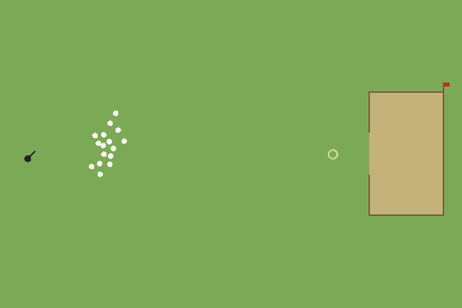
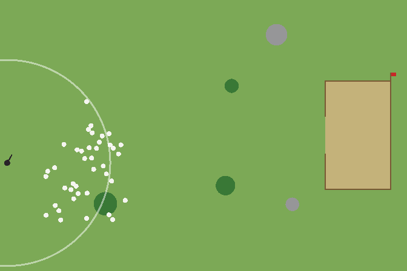

# Sheepdog Herding — RL Environment

A reinforcement-learning re-creation of the browser game
[*Shepherd's Dog*](https://vnglst.github.io/when-ai-fails/shepards-dog/claude-fable-5/index.html).

You control a sheepdog with limited speed. Moving the pointer steers the dog;
clicking makes it **bark**, which sends nearby sheep bolting away. The flock
behaves as one — it clumps, flees the dog, and avoids bushes and rocks. The pen
is a **fenced box with a single opening of fixed width**: the flock can only get
in through the gap, so it has to be funnelled, not just shoved at a wall. Your
job is to herd at least **80% of the flock into the pen before nightfall**.
Optional **wolves** appear at dusk and pick off stray sheep.



The sheep follow the **Strömbom et al. (2014)** shepherding model — the standard
mathematical model for this exact behaviour (cohesion + separation +
flee-from-dog + inertia + noise). Every weight is exposed and documented in
`sheepdog_env/flocking.py` so you can retune it to match a specific game build.

## Install

The core environment is a self-contained Python package (`sheepdog_env`) with
only **numpy** and **gymnasium** as dependencies. Install it as a module:

```bash
git clone https://github.com/midhunharikumar/sheepdog-rl.git
cd sheepdog-rl
pip install -e .                  # core env only: numpy + gymnasium
```

Optional extras pull in what the demo/training scripts need:

```bash
pip install -e ".[render]"        # pygame + imageio + pillow (live window / gif export)
pip install -e ".[train]"         # stable-baselines3 + wandb (RL training + tracking)
pip install -e ".[test]"          # pytest
pip install -e ".[all]"           # everything above
```

You can also install straight from a checkout for use as a library in another
project (`pip install /path/to/sheepdog_rl`), or list it as a git dependency.

## Quick start

```python
from sheepdog_env import SheepdogHerdingEnv

env = SheepdogHerdingEnv(obs_mode="vector")   # or "pixel"
obs, info = env.reset(seed=0)
for _ in range(1000):
    action = env.action_space.sample()        # [move_x, move_y, bark]
    obs, reward, terminated, truncated, info = env.step(action)
    if terminated or truncated:
        break
```

It is also registered with Gymnasium: `gym.make("SheepdogHerding-v0")` after
`import sheepdog_env`.

## Action space — `Box(3,)`, all in `[-1, 1]`

Interpretation is set by `action_mode` (default `"polar"`):

**`"polar"`** — velocity, orientation, bark:

| Index | Meaning |
|-------|---------|
| `a[0]` | **speed**, mapped `[-1,1] → [0, dog_max_speed]` |
| `a[1]` | **heading / orientation**, mapped `[-1,1] → [-π, π]` |
| `a[2]` | **bark** when `> 0` (subject to a cooldown) |

**`"cartesian"`** — `a[0], a[1]` are a velocity vector (magnitude clamped to the
dog's max speed) and `a[2]` is bark.

**Bark** scares nearby sheep into bolting **radially outward from the dog's
position**, faster and harder than normal (the classic sheepdog behaviour). So
the dog steers the flock by *where it stands* — get behind the flock relative to
the gap and bark to drive them toward it. Barking has a cooldown, so spamming
does nothing extra. (Set `FlockParams.bark_directional=True` to instead drive
sheep along the dog's heading — easier to funnel, less realistic.) A `Box`
action keeps the env compatible with continuous algorithms (PPO, SAC, TD3).

## Observation space

Set per env with `obs_mode`:

- **`"vector"`** (default, fast to train): a flat, normalized `Box` containing
  the dog's position/velocity and bark-ready flag, the pen rectangle, the
  **opening (gap) location and width**, time- and penned-fractions, every sheep's
  position (relative to the dog), velocity and status (free / penned / lost), and
  the obstacles. Dimension for the defaults (40 sheep, 5 obstacles) is **229**.
- **`"pixel"`**: an `(84, 84, 3)` `uint8` top-down render — use a CNN policy.

Both share identical dynamics, so you can train on vectors and evaluate on
pixels (or vice-versa).

## Reward

A single, dense, easy-to-reason-about reward:

- **+ pen reward** — `w_pen_enter` (default 10) each time a sheep enters the pen.
- **+ final** — at episode end, `w_final` × (fraction of the flock penned), so
  "more sheep home at the end" is directly maximized.
- **− entrance** — per step, `w_entrance` × the mean distance of *un-penned*
  sheep to the **entrance** (the gap). This is the dense gradient that pulls the
  flock toward the opening from step one.
- **− back** — per step, `w_back` × the fraction of un-penned sheep driven
  *behind* the pen (the far side from the entrance), discouraging herding the
  flock around the pen instead of through the gap.
- **− cohesion** — per step, `w_cohesion` × how spread out the free flock is
  (mean distance of un-penned sheep to their centroid). Rewards keeping the herd
  together — important because the radial bark tends to fan the flock out.

With the defaults a stalling agent scores ≈ −180, a clean win ≈ +400, and
partial penning is positively rewarded in between — a smooth, dense gradient
toward penning with no "park and stall" local optimum. All weights live in
`EnvConfig`. The CEM planner (below) confirms this reward is well-aligned:
maximizing it pens 90% of the flock.

## Episode end

- **Success** (`terminated`): ≥ `target_fraction` of the flock penned.
- **Nightfall** (`truncated`): `max_steps` reached — one full "day".
- **Lost** (`terminated`): too few sheep remain to ever reach the target
  (only possible with wolves enabled).

## Configuration

Pass an `EnvConfig`, or override individual fields as keywords:

```python
from sheepdog_env import SheepdogHerdingEnv, EnvConfig

env = SheepdogHerdingEnv(
    n_sheep=60,
    dog_max_speed=2.0,
    enable_wolves=True,
    target_fraction=0.8,
    obs_mode="pixel",
)
```

Notable knobs (see `env.py` / `flocking.py` for the full list and defaults):
`width`, `height`, `n_sheep`, `target_fraction`, `max_steps`, `action_mode`
(`polar`/`cartesian`), `dog_max_speed`, `bark_cooldown`, `bark_duration`,
`pen_frac`, `pen_opening_side`
(`left`/`right`/`top`/`bottom`), `pen_opening_center`, `pen_opening_width`,
`n_bushes`, `n_rocks`, `enable_wolves`, `dusk_fraction`, `n_wolves`, the reward
weights (`w_pen_enter`, `w_final`, `w_entrance`, `w_back`, `w_cohesion`), and the whole
`FlockParams` block (sheep speed `delta`, cohesion `c`, separation `rho_a`, dog
repulsion `rho_s`, detection radius `r_s` — lower lets the dog get closer before
the flock bolts — fence repulsion `rho_w`, and the bark amplification
`bark_radius` / `bark_speed_mult` / `bark_impulse`, etc.).

## Examples

```bash
python examples/demo.py                  # scripted shepherd -> demo.gif
python examples/demo.py --random         # random policy
python examples/demo.py --human          # live pygame window
python examples/demo.py --wolves         # enable dusk wolves
python examples/heuristic_agent.py       # print a scripted-agent rollout
python examples/cem_solver.py --gif cem.gif   # CEM planner: solves the task by planning
python examples/rollouts_gif.py          # 2x2 montage of rollouts -> rollouts.gif
python examples/train_sb3.py --timesteps 1000000   # PPO (vector obs), logs to W&B
python examples/eval_sb3.py --model ppo_sheepdog --episodes 50   # evaluate a trained model
python examples/play_sb3.py --model ppo_sheepdog   # live pygame viewer of a policy
python examples/play_sb3.py --heuristic            # live viewer, no model needed
python examples/play_sb3.py --mouse                # play it yourself with the mouse
python -m pytest tests/ -q               # tests
```

Training logs to **Weights & Biases**. Run `wandb login` once (or set
`WANDB_API_KEY`); metrics, config and periodic model checkpoints sync to the
`sheepdog-rl` project. Use `--wandb-project NAME` / `--wandb-entity TEAM` to
change the destination, `--wandb-mode offline` to log locally and sync later, or
`--no-wandb` to disable tracking entirely.

Training wraps the env in **`VecNormalize`** (normalizes rewards, and
observations for the vector env). The normalization stats are saved next to the
model as `<save>_vecnorm.pkl`; `eval_sb3.py`, `play_sb3.py` and
`inspect_policy.py` auto-detect and apply them (override with `--vecnorm PATH`).
If you train your own loop, remember the policy expects **normalized**
observations at inference.

### CEM planner (`examples/cem_solver.py`)

Because the environment is its own fast simulator, you can **plan** instead of
(or before) learning. The Cross-Entropy Method optimizes an open-loop action
sequence by *cloning* the env and rolling candidate paths forward to score them
— evaluating paths before committing — then refining the sampling distribution
toward the best ("elite") ones. Actions are piecewise-constant segments to keep
the search low-dimensional, and all candidates in an iteration share the same
cloned state and RNG (common random numbers) for low-variance comparison.

```bash
python examples/cem_solver.py --seed 0 --gif cem.gif
```



It's a useful planning baseline / oracle, a sanity check that the (dense, simple)
reward is well-aligned, and a source of expert trajectories for imitation warmup.
(With the *directional* bark it pens ~90% in under 100 steps; with the default
*radial* bark — which fans the flock out — funneling through the narrow gap is
much harder, so give it more samples/iterations.)

### Imitation warmup (`examples/cem_to_bc.py`)

Bootstrap RL past the hard exploration: collect expert rollouts (from CEM or the
fast heuristic), keep only the good ones (`--min-penned`), behavior-clone an SB3
policy on them, then **fine-tune with PPO**:

```bash
python examples/cem_to_bc.py --source heuristic --seeds 0..15 --min-penned 20 --save bc_sheepdog
python examples/train_sb3.py --init-from bc_sheepdog        # PPO continues from the BC policy
```

BC alone won't herd well (covariate shift: small errors compound over a long
episode), so it's intended as a *warm start* — `--init-from` copies the BC policy
weights and observation-normalization stats into PPO, which then fixes the drift
by exploring around the demonstrated behaviour. Demo quality is the bottleneck:
the cloned policy is only as good as the rollouts you feed it.

`examples/heuristic_agent.py` is a classic collect-and-drive shepherd — a
*non-trivial baseline, not an expert policy*. It pens a portion of the flock but
does **not** reliably hit the 80% target: herding 40 sheep through a single
narrow opening while the dog is fenced out of the pen is a hard control problem
(a naive point-shepherd tends to fragment the flock against the field edges).
That difficulty is the point — it's what makes this a worthwhile RL benchmark
rather than something a few lines of geometry can solve.

## Layout

```
sheepdog_rl/
├── sheepdog_env/            # the installable module
│   ├── __init__.py          # exports + Gymnasium registration
│   ├── env.py               # SheepdogHerdingEnv, EnvConfig
│   ├── flocking.py          # Strömbom flock dynamics + FlockParams
│   ├── geometry.py          # pen fence: build walls, repulsion, crossing collision
│   ├── rendering.py         # NumPy renderer (+ optional pygame window)
│   └── vec_env.py           # BatchedSheepdogVecEnv (fast SB3 VecEnv, optional)
├── examples/                # demo, heuristic agent, CEM planner, SB3 training/eval
├── tests/                   # API conformance + vec-env parity tests
├── assets/                  # curated demo GIFs used by this README
├── ppo_sheepdog.zip         # pretrained PPO policy (+ _vecnorm.pkl) for eval/play
├── pyproject.toml           # package metadata + extras
├── requirements.txt
└── LICENSE
```

## Matching the original game exactly

The dynamics are faithful to the genre and the observed behavior, but the
numeric constants are tuned approximations, not byte-for-byte copies of the
original JavaScript (its source couldn't be auto-extracted in this session). If
you paste the game's JS — or run it with the browser dev tools open — the
mapping is direct: dog speed, bark radius/strength, the day length, sheep count
and the flock weights all have one-to-one counterparts in `EnvConfig` /
`FlockParams`.

## Reference

Strömbom, D. et al. (2014). *Solving the shepherding problem: heuristics for
herding autonomous, interacting agents.* Journal of the Royal Society Interface.

## License

[Apache License 2.0](LICENSE).
